#### 组员

##### 16340308 钟霖

##### 16340315 朱俊凯

#### 分工

##### 钟霖

- 基于流水的C/S架构
- 超时重传
- 拥塞控制
- 流量控制

##### 朱俊凯

- 基于停等协议的多客户端传输的C/S架构
- 命令行实现
- 测试文档

#### 功能实现

- [x] 超时重传
- [x] 拥塞控制
- [x] 流量控制
- [x] 多客户端传输
- [x] 命令行

#### 程序架构

* 代码文件如下：采用了C/S架构，总体分为server端和client端。server端和client端都会根据命令情况，决定是应该调用Receiver中的dataReceive方法接收数据还是Sender中的dataSend接收数据，例如：client端执行 lget 命令，服务端则调用dataSend进行传输，client端则调用dataReceive进行接收。

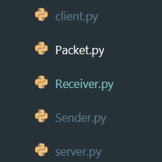

#### 超时重传

每次传输包之后，我们会新建线程来接收客户端返回的确认包，try中的recvfrom操作如果超时就意味着服务端认为对方没有接收，就会在except中返回None，否则接收确认包，并解析其中信息。windowsize是指客户端目前缓冲区大小，根据这个windowsize和客户端当前窗口大小进行流量控制；seq是确认接收包的序号。

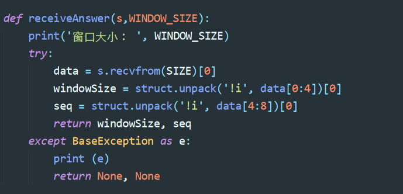

dataSend中新建线程接受包：count是指当前窗口中发出的包，因为有些包是已经确认发出，不需要再次发送，这里使用的是选择重传的方式，因此要记录被发送包的个数，以此开启相应多个线程来接收确认包。开启的线程放入 li 数组中，然后遍历这些线程，并调用join方法，join方法是阻塞的，即等待线程执行完再返回主线程进行操作，否则主线程在下面调用get_result会出现错误，原因就是子线程可能还没有执行完。tag是用来标识窗口是该执行慢启动还是拥塞启动，根据get_result的结果判断是否发生重传，然后对窗口进行相应的变动。

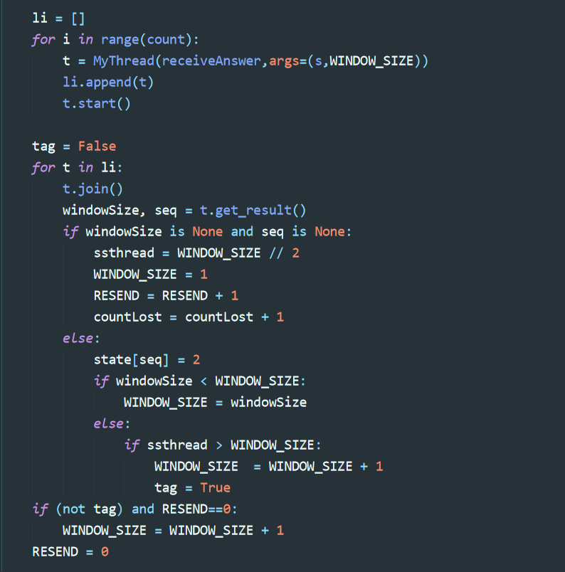

#### 流量控制

下面代码是Receiver的dataReceive的部分代码，主要看s.sendto，这是向发送者发送确认包，它会发送包的序号seq和缓冲区剩余大小BUFFERSIZE-len(bufferdata)。

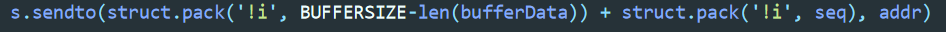

Sender则根据返回来的windowSize，即BUFFERSIZE-len(bufferdata)来设置当前窗口大小，如果窗口比Receiver缓冲区剩余大小还大，那么就让当前窗口大小变为Receiver缓冲区剩余大小。这里的windowSize是从判断超时重传的线程中返回的结果，可以看上面超时重传中代码截图。

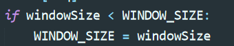

#### 拥塞控制

如果当前窗口大小比ssthread值要小，那么选择慢启动，即每收到一个确认包就让窗口加1，并置tag为True，否则选择拥塞启动，即整个窗口的包都成功接收之后，窗口大小才加1，这里RESEND记录的是丢包数。

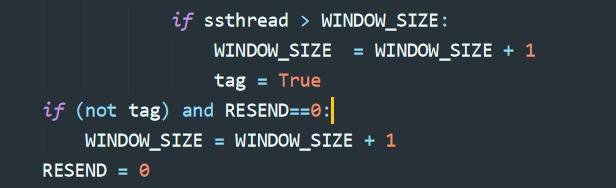

#### 滑动窗口

count是记录在拥有最小序号的未确认包之前已确认发送包的个数，然后让窗口滑动距离为这个值，具体实现就是让删除Sender缓冲区的前count个数据，例如：现在缓冲区有5个包，前两个包已确认接收，第3个包没有确认接收，那么前两个包就可以从缓冲区丢弃，因为我们已经知道它们被成功接收了。

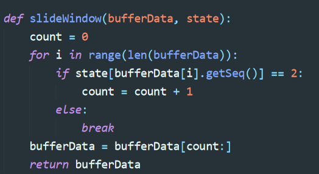

#### 多客户端的实现

在server端中先用一个socket监听8000端口，这个端口用于监听客户端的请求。客户端发来请求之后，再新建一个socket，这个socket绑定的端口由客户端传来的端口所决定。每来一个客户端，就创建一个线程，线程的target由客户端输入的命令所决定是选择dataSend还是dataReceive。

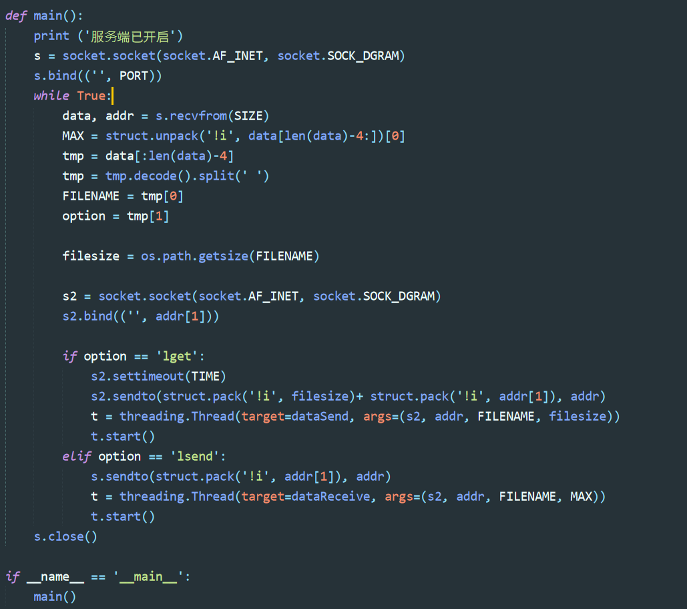

#### 一些实现方法

Sender在dataSend中定义了一个state数组，该数组保存的是包的发送情况，其对应的下标就是包的序号，例如state[0]是代表包0的状态。每次发送时，将对应包的状态置为1，代表正在发送，如果超时重传，则重新置为0，成功接收则置为2。

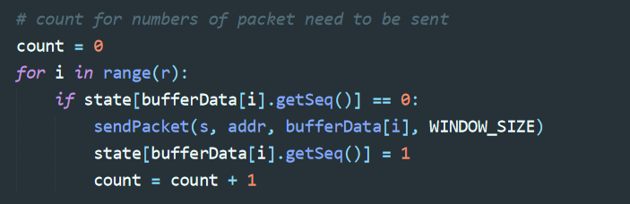

以下为Sender将发送数据读入缓冲区的实现，当前窗口大小如果比缓冲区大，那么就动态读取数据进缓冲区，每次读入1000个字节，当数据读取完毕，那么置FINISH标识符为True，随后程序在将剩余包确认发送完毕就会跳出循环，每读入一个包就会通过SEQ设置其序号，SEQ是dataSend函数中记录包序号的变量，同时state也会添加一个元素，然后将这个包状态置为0。

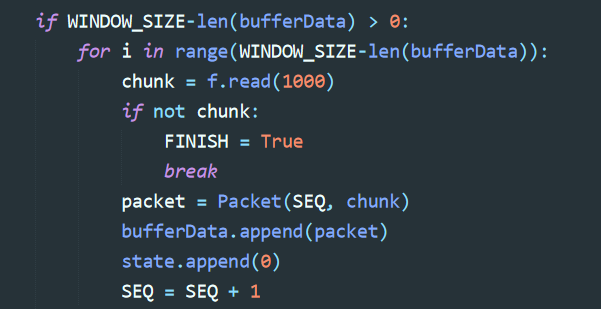

Receiver通过一个变量名为save的set来判断包是否被接收，避免重复接收，如果包的序号不存在于set中，那么就向Receiver的缓冲区添加一个包，并且向save中记录这个包的序号。

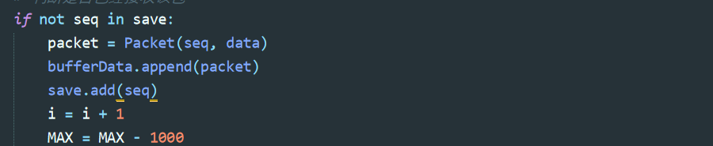

这个是Receiver中将包写入文件的操作，因为接收到的包可能是时序的，所以要对缓冲区的包进行排序，SEQ是Receiver中记录最后写入的包的序号，根据这个序号可以确定下一个应该写入包的序号，以此保证不会乱序写入，同时每写入一个包的数据，就让SEQ加1，并且从缓冲区中删除这个包。

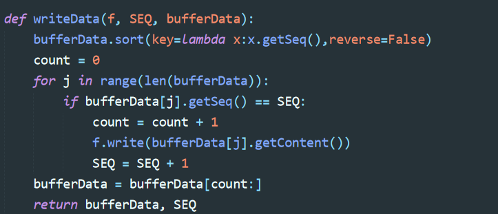

#### 程序测试及其运行结果

在两台不同的主机中，连入相同的wifi，然后一台作为服务端，另一台作为客户端。

在服务器终端输入py server.py打开服务器。

在客户端终端输入 py client.py LFTP lget XXX.XXX.XXX.XXX filename。

600多m大小的文件传输，一个客户端接收。（Receiver.py的全局变量BUFFERSIZE为128）

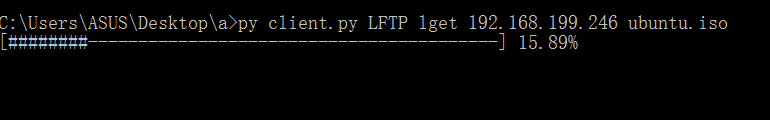

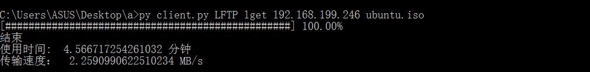

1.5G文件测试（另一台主机测试，Receiver.py的全局变量BUFFERSIZE为500，因为通过BUFFERSIZE进行流控，如果接收端有足够的缓冲区大小，而发送端主机性能无法跟上，就会导致内存和CPU利用率过高，传输速率下降。）

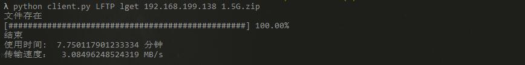

传输过程中，发送者会有窗口大小和传输错误的显示，可以看见，发现超时重传，窗口会减小。最后发送者会输出重传率。

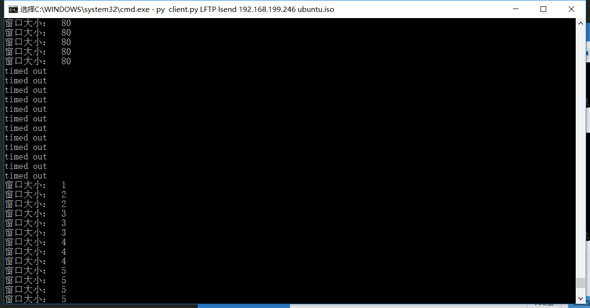

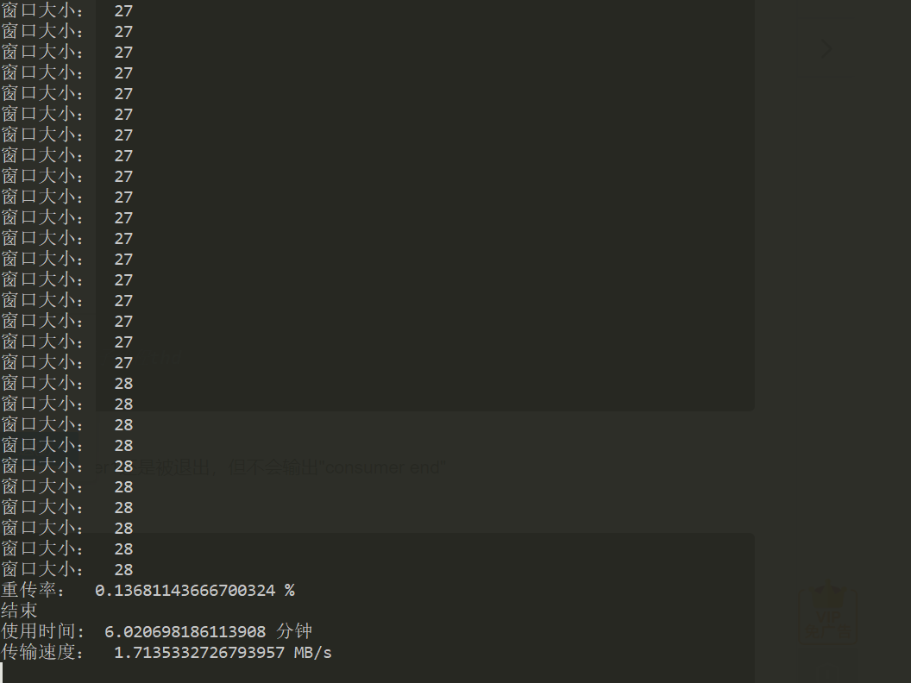

600多m大小的文件传输，两个客户端接收

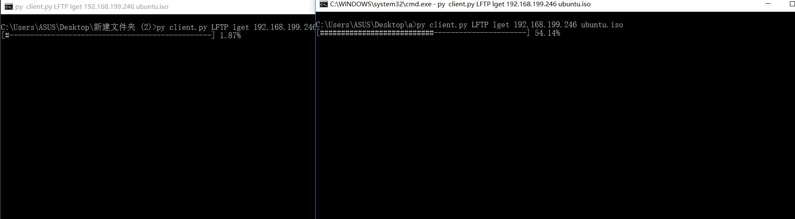

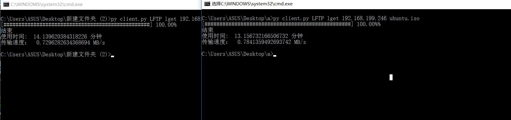

客户端输入py client.py LFTP lsend XXX.XXX.XXX.XXX filename向服务端发送文件

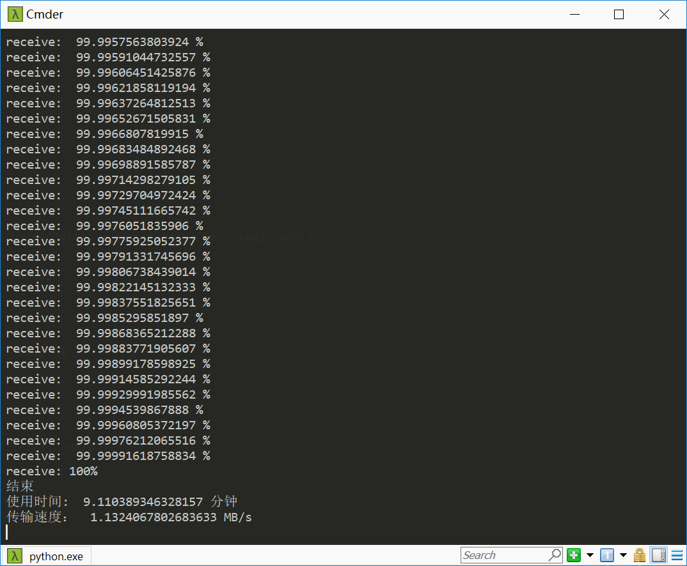

当输入的文件不存在，终端会显示

